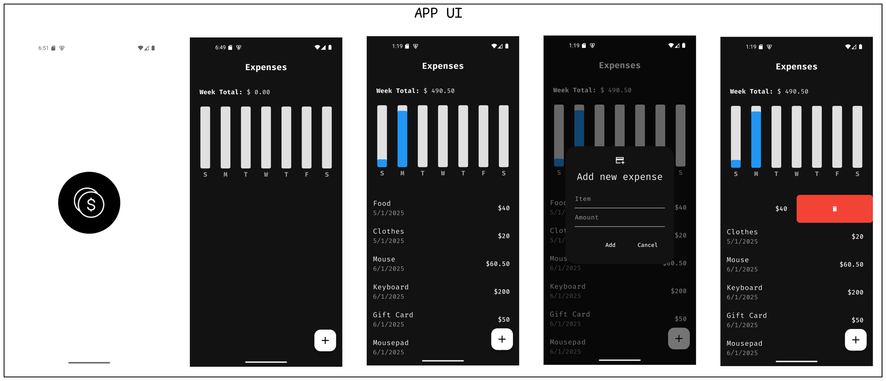

# expense_tracker_app

A Flutter application for expense tracking using Provider and Hive Database for local storage.

## Features

The following are the features of this application:

### CRUD Operations

- Create a new expense.
- Read and display expense in real-time.
- Delete an expense.

### Bar Graph Visualization

- Represent the user's expense in Bar Graph formate.

## File Structure

```bash
assets/
│
├── font/                  # Fonts used in the app
├── icon/                  # App Icons
└── screenshots/           # UI Screenshots
lib/
│
├── bar_graph/             # Building the Bar Graph
├── components/            # Reusable widgets and UI componets
├── database/              # Hive Database Service
├── datetime/              # Utility to get date time in string formate
├── models/                # Data models for the application
├── pages/                 # UI screens for the application
└── main.dart              # Main entry point of the application
```
## App Icon

The app icon is made using the following websites:

- [Figma](https://www.figma.com/)
- [IconMonstr](https://iconmonstr.com/)


## UI Screens



## Getting Started

### Prerequisites

- Have [Flutter](https://flutter.dev/) installed on your machine.
- Check the documentation of [HiveDatabase](https://hivedb.dev/#/) for more info on it.

### Packages used

- [provider](https://pub.dev/packages/provider)
- [hive](https://pub.dev/packages/hive)
- [hive_flutter](https://pub.dev/packages/hive_flutter)
- [path_provider](https://pub.dev/packages/path_provider)
- [flutter_slidable](https://pub.dev/packages/flutter_slidable)
- [flutter_launcher_icons](https://pub.dev/packages/flutter_launcher_icons)

### Installation

1. Clone the repository:

```bash
git clone https://github.com/usman619/expense_tracker_app.git
cd expense_tracker_app
code .
```

2. Install the dependencies:

```bash
flutter pub get
```

3. If you want to change default app icon, goto the file 'flutter_launcher_icons.yaml' and change the path used in 'image_path' and after that run the following command in your terminal:

```bash
dart run flutter_launcher_icons:main
```

4. Run using the following command:

```bash
flutter run
```
